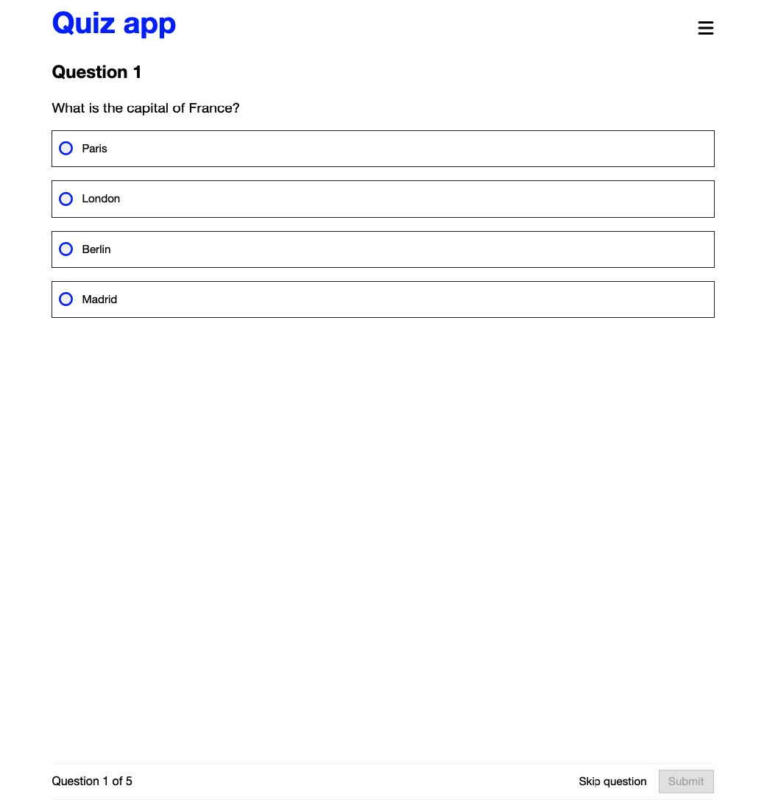

# SOFTWARE DEVELOPMENT COURSES - LUT PROJECT

This is the final project for frontend module for the software development courses offered by Lappeenranta University of Technology (LUT), Finland.

## Deployed website

Visit - [Quiz App sass](https://sulaymon333.github.io/quiz-app-sass/root/)

## Demo Picture

## Author

Sulaymon Tajudeen

## Tech Stack

-   HTML
-   CSS
-   Sass (Scss)
-   JavaScript

## License

This project is licensed under the MIT License - see the [LICENSE](./LICENSE) file for details.
